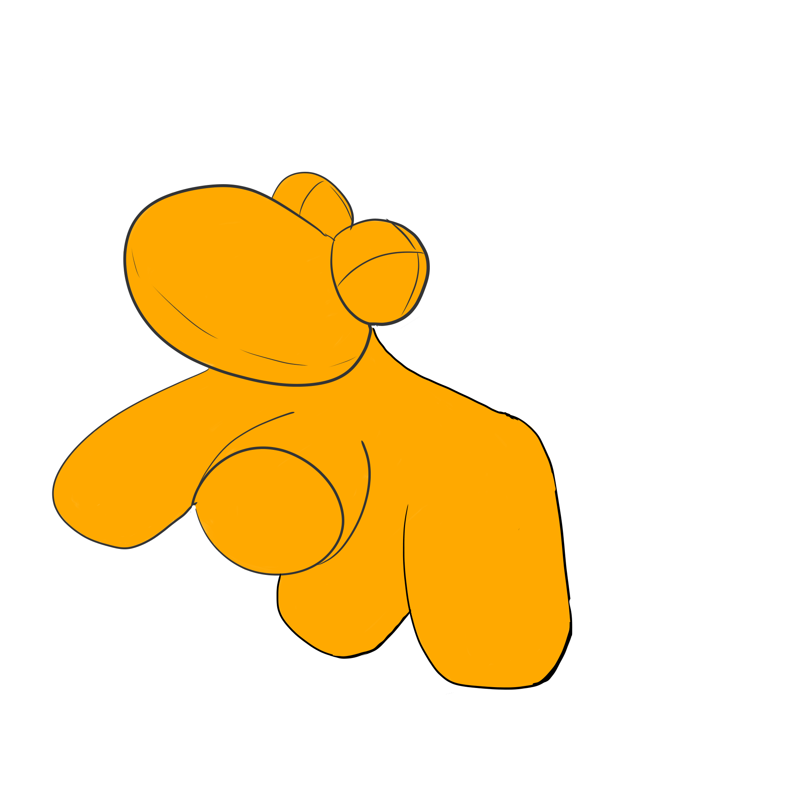

<!--- below block is for justifying text --->
```{css, echo = FALSE}
.justify {
  text-align: justify
}
```

::: {.justify}

The purpose of this wiki is to collate useful information and technical knowledge. For now, I (shikhara) am just porting some notebooks I already had. Will hopefully flesh out the wiki later.

To go back to the kokkonutscase repository of scripts, click [here](https://github.com/Kokkonut-case).
<br>
To visit the kokkonuts lab group webpage, click [here](https://www.kokkonuts.org/).
<br>


## Lab meeting talks

Goals of this endeavour: as speaker one gets feedback on & practice presenting projects, space to discuss something we're currently stuck on, etc.; and from being in the audience, we all learn more deeply about each others’ work.

Details of the talks: - The talks happen once every two weeks, and the person up that week gets \<= 30 minutes (i.e. you can use fewer than 30. and for those with time concerns: the whole lab meeting will remain capped to one hour). - We are currently 9 in the group, so this means a given person presents roughly once every 4-5 months. - Example use cases: presenting recent results, going through a model that you are constructing, discussing ideas / planned new work, or perhaps even watching an online talk together that you'd like to watch. And any other use that you think is appropriate. - Presentation medium can be slides, writing on a board, anything. The idea is not (at all) to have very polished presentations; it doesn’t have to be anywhere near “finished” work

### Schedule 2025

The dates below are for every second Wednesday starting the week of 27 January, upto and including the month of April (note the change in dates because we have switched to Wednesday lab meetings from Thursday). 


| Date        | Speaker       |
|-------------|---------------|
| 29 January  | Tom           |
| 5 February  | Gaurav        |
| 12 February | Mos           |
| 19 February | \-            |
| 26 February | Shikhara      |
| 5 March     | \-            |
| 12 March    | Roman         |
| 19 March    | \-            |
| 26 March    | Tabea/Margaux |
| 2 April     | \-            |
| 9 April     | Victor        |
| 16 April    | \-            |
| 23 April    | Margaux       |
| 7 May       | \-            |
| 14 May      | \-            |
| 21 May      | \-            |
| 28 May      | \-            |


## Onboarding

### EU citizens 

### Non-EU citizens


## Computing 

### Downloading software

### Getting help

### Using MOGON 2


## Completing or supervising a bachelor thesis

### Supervisors

### Students


## Teaching in the Kokkonuts

### Masters level

### Bachelor level


## Seminars and mailing list

:::
